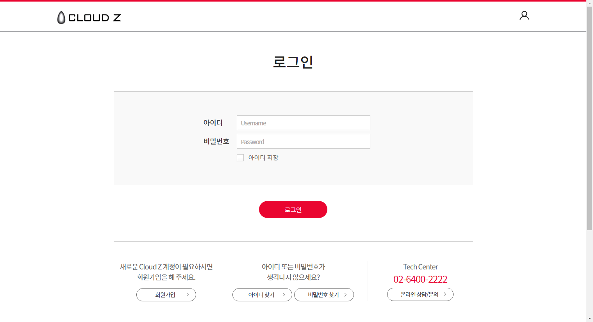

# 사용하기

## 사용자 로그인


Cloud Z사용자 포탈을 접속하여 오른쪽 상단 로그인 버튼을 클릭하면 다음과 같이 아이디와 비밀번호를 입력하는 페이지가 나타납니다. 올바른 계정 정보를 입력 후 로그인 시 Cloud Z 포털 메인화면으로 이동되며, 계정정보가 기억나지 않는다면 &lt;아이디 찾기&gt;와 &lt;비밀번호 찾기&gt;를 통해 관련 정보를 찾을 수 있습니다.

만약 비밀번호를 잘못 입력하면 다음과 같은 화면이 나타납니다.

